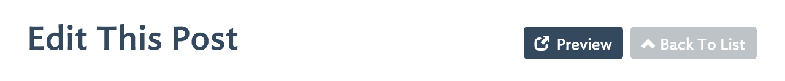

.. _panel-anatomy:

Anatomy of a Panel 
==================

Panels are the heart and soul of Station. Out of the box, panels contains all of the functionality necessary for a user to manipulate a specific type of data in your database. There are numerous options for panels and elements giving you the flexibility to craft back-end tools to fit virtually any scenario or database structure.

Typically each panel maps to a database table one-to-one. However, a panel can also contain one or more **subpanels** as well as references to other tables for lookup capabilities.

A panel can also be complete overriden so you can build your own functionality from scratch, but within the user-authenticated comfort of Station.

The Build Command
-----------------

Each time you add a new panel or change a panel's configuration you need to run ``php artisan station:build``.

This artisan command will analyze your panels and elements and then do the following:

* generate migrations for any missing database fields, including database pivot tables
* run the new migrations 
* generate / refresh models with foreign relationships for each panel (see ":ref:`models`" for more info)
* seed the database (only when new user groups have been added)

If you attempt to navigate to a newly created panel in the Station navigation, you will likely encounter errors. You must run the build command first.

Panel Creation Workflow
----------------------- 

As discussed in ":ref:`app-level-configuration`", when you add new array elements to the ``user_groups`` associative array in your ``config/packages/lifeboy/station/_app.php`` file, you are in-effect registering new panels with Station.

Station is able to determine the behaviors of each panel given the values of the configuration parameters found in each panel's configuration file. For example, if you have a panel named ``posts`` in your ``config/packages/lifeboy/station/_app.php`` file, then you need a corresponding ``posts.php`` file in the ``config/packages/lifeboy/station/`` directory to define the parameters of that panel.

For example, refer to the ``config/packages/lifeboy/station/users.php`` file which was packaged with your installed copy of Station, you will notice that there are two top-level array keys, ``panel_options`` and ``elements``:

.. code-block:: php 

	'panel_options'	=> [
		
		// define your panel-level options here...	
	],
			
	'elements'	=> [

		// define your element-level options here...
	],

Panel options control the overall configuration of the panel (think of this as database table-level options). Elements define how your users interact with specific database fields.

Without further ado, what follows is an exhaustive list of each and every panel and element option possible along with specific examples for each. Dive in!

Panel Options
=============

*Note: all options marked with an * are required*

table * 
-------

Quite simply, this is the name of the database table to which this panel corresponds. Note that you can have many panels which use the same table. 

.. code-block:: php 

	'panel_options'	=> [

		'table' => 'posts',	
		...
	],

single_item_name *
------------------

This is the singular version of the type of data which is being dealt with in this panel.

.. code-block:: php 

	'panel_options'	=> [

		'table'              => 'posts',	
		'single_item_name'   => 'Post', 
		...
	],

allow_bulk_delete
----------------- 

Setting this option to true will allow users to select and delete multiple items in list views (including filtered list views)

default_order_by [default = id]
------------------------------- 

This option allows you to set the order in which records for this panel will be displayed. You can choose one or more database fields. You will use traditional SQL syntax.

.. code-block:: php 

	'panel_options'	=> [

		'table' => 'posts',	
		'default_order_by' => 'title ASC, date DESC',
		...
	],

has_timestamps
-------------- 

If this option is set to true then the migrations and models generated for this panel/table will create and utilize Laravel Eloquent's ``created_at`` and ``updated_at`` timestamp fields.

.. code-block:: php 

	'panel_options'	=> [

		'table' => 'posts',	
		'has_timestamps' => TRUE,
		...
	],

js_include
---------- 

This option allows you to specify a javascript file to include on all pages of this panel. It is great for sewing in your own functionality. jQuery is available on all pages as well.

.. code-block:: php 

	'panel_options'	=> [

		'table' => 'posts',	
		'js_include' => '/js/my-own.js',
		...
	],

no_data_force_create
-------------------- 

When this option is set to true it will redirect a user who is trying to access a panel's (initial) list view to the panel's create view instead.

.. code-block:: php 

	'panel_options'	=> [

		'table' => 'posts',	
		'no_data_force_create' => TRUE,
		...
	],

override
-------- 

This option allows you to completely override the functionality of a specific panel using a controller and method from your Laravel app. For an example of this, look at the ``welcome`` panel which shipped with Station.

.. code-block:: php 

	'panel_options'	=> [

		'table' => 'posts',	
		'override' => ['L' => 'MyControllerName@method_name'],
		...
	],

The ``L`` above means that this will override the (initial) list view of your panel. However you can override the ``U`` (update) function instead and just leave the list view as-is using ``'override' => ['U' => 'MyControllerName@method_name'],``. When using the update override, the record your user is attempting to modify will be passed as data to your controller method automatically.

preview_url
----------- 

This option allows you to specify a array template for generating the url for a button which will become visible in the update view of every record in this panel. 

.. code-block:: php 

	'panel_options'	=> [

		'table' => 'posts',	
		'preview_url' => ['http://www.domain.com/post/', 'posts.id', '/preview'],
		...
	],

The elements of this array will concatenate to form the preview URL. When one of the array's elements is in the format ``table_name.field_name`` it will be replaced by the actual record's value. So the example above might produce ``http://www.domain.com/post/9999/preview`` and a button which looks like the one below will appear on your panel's update pages:

where
-----

This option allows you to append a SQL ``where`` clause onto the standard query which retrieves the data for this panel.

.. code-block:: php 

	'panel_options'	=> [

		'table' => 'posts',	
		'where' => 'title LIKE "%robot%"',
		...
	],

This is also a good opportunity to pass in :ref:`config-variables` or :ref:`custom-config-variables` if those are relevant to your app.

.. code-block:: php 

	'panel_options'	=> [

		'table' => 'employees',	
		'where' => 'company_id IN (%user_company_ids%)',
	],

Element Options 
=============== 

name 
---- 

type
----

.. _config-images:

sizes
-----