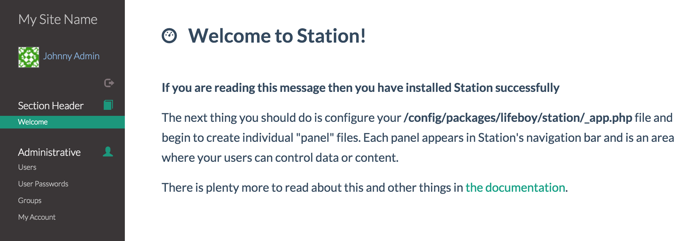

Installation 
============

**1. Environment**

Make sure Laravel is already installed and running. You should already have a valid database connection. This install process works best on a fresh Laravel installation. 

**2. Install Using Composer**

Station should be installed via `Composer`_ by requiring the ``lifeboy/station`` package in your project's ``composer.json``.

.. code-block:: json

	{
	    "require": {
	        "lifeboy/station": "dev-master"
	    }
	}

Then run a composer update

.. code-block:: sh

	composer update

.. _Composer: http://getcomposer.org

This assumes you have a working dev or production environment with Laravel 5 and a database already installed and configured.

**3. Register Station Within Laravel**

To use Station, you must register the provider when bootstrapping your Laravel application.

Find the ``providers`` key in ``app/config/app.php`` and register the Station Service Provider.

.. code-block:: php 

    'providers' => array(
        // ... add below ...
        Lifeboy\Station\StationServiceProvider::class,
        Collective\Html\HtmlServiceProvider::class,
    ),

Also update the ``aliases`` key in ``app/config/app.php``

.. code-block:: php 

    'aliases' => [
        // ...
        'Form' => Collective\Html\FormFacade::class,
        'Html' => Collective\Html\HtmlFacade::class,
    ],

In ``app/Http/Kernel.php``, update the ``$routeMiddleware`` class variable:

.. code-block:: php 

	protected $routeMiddleware = [
	    // ...
	    'station.session' => \Lifeboy\Station\Filters\Session::class
	];

**4. Publish Station's Assets to Laravel**

.. code-block:: sh 

	php artisan vendor:publish

.. note::

	We sometimes see a "path not found" warning on this step. You can safely ignore this.

**5. Run Default Migrations**

.. code-block:: sh 
	
	php artisan migrate

**6. Set the Administrator Email**

In ``config/packages/lifeboy/station/_app.php`` set the ``root_admin_email`` to your email address.

**7. Run Station's Build Command**

This will generate new migrations, run the new migrations, generate models, and seed the database.

.. code-block:: sh 

	php artisan station:build 

**8. Test Installation**

You should now be able to browse to your app at: ``http://{host}/station/``. You can login using user/password: ``admin/admin``. Upon login, you will see a welcome screen:

**9. Configure Station and Your Panels!**

That's it! Next you will configure Station and tailor it to the needs of your users.

.. note::

	You will be able to configure and test Station now. However, to run Station in production, please make sure that your email system has been configured and enabled. (See :ref:`emailers` for more info).

